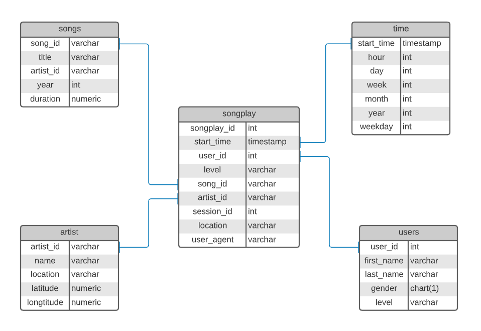

# Data Modeling with Postgres

[](https://img.shields.io/badge/project-passed-success.svg)

## Introduction

A startup called Sparkify wants to analyze the data they've been collecting on songs and user activity on their new music streaming app. The analytics team is particularly interested in understanding what songs users are listening to. Currently, they don't have an easy way to query their data, which resides in a directory of JSON logs on user activity on the app, as well as a directory with JSON metadata on the songs in their app.

They'd like a data engineer to create a Postgres database with tables designed to optimize queries on song play analysis, and bring you on the project. Your role is to create a database schema and ETL pipeline for this analysis. You'll be able to test your database and ETL pipeline by running queries given to you by the analytics team from Sparkify and compare your results with their expected results.

## Project Summary

In this project, you'll apply what you've learned on data modeling with Postgres and build an ETL pipeline using Python. To complete the project, you will need to define fact and dimension tables for a star schema for a particular analytic focus, and write an ETL pipeline that transfers data from files in two local directories into these tables in Postgres using Python and SQL.

## Prerequisites

The folowing assumptions are required to succesfully run this project:

* Python 3 is installed
* `pandas` and `psycopg2` are installed
* A PosgreSQL database is installed in the localhost

### Data

- **Song datasets**: The first dataset is a subset of real data from the Million Song Dataset. Each file is in JSON format and contains metadata about a song and the artist of that song. The files are partitioned by the first three letters of each song's track ID. For example, here are filepaths to two files in this dataset.

```
song_data/A/B/C/TRABCEI128F424C983.json
song_data/A/A/B/TRAABJL12903CDCF1A.json
```

- **Log datasets**: The second dataset consists of log files in JSON format generated by this event simulator based on the songs in the dataset above. These simulate activity logs from a music streaming app based on specified configurations.  

The log files in the dataset are partitioned by year and month. An example of this arrangament is described below.

```
{
    "num_songs": 1,
    "artist_id": "ARJIE2Y1187B994AB7",
    "artist_latitude": null,
    "artist_longitude": null,
    "artist_location": "",
    "artist_name": "Line Renaud",
    "song_id": "SOUPIRU12A6D4FA1E1",
    "title": "Der Kleine Dompfaff",
    "duration": 152.92036,
    "year": 0
}
```

## Database Schema

A Star Schema was used to complete this project, since 1 fact table and 4 dimension tables (*songs*, *artists*, *users* and *time*) were required.

The proposed design was selected to gain flexibility with the queries.




## Project structure

Files used on the project:
1. **data** This directory contains a collection of JSON log files.
2. **create_tables.py** drops, creates and reset tables.
3. **sql_queries.py** contains all SQL queries.
4. **etl.ipynb** Jupyter Notebook used to conduct EDA and test ETL process.
5. **etl.py** Python script that reads in the Log and Song data file.
6. **test.ipynb** Jupiter Notebook, created to test this database.
7. **README.md** Project description and instructions.

## Instructions

At the terminal:

1. Run create_tables.py from terminal to set up the database and tables.
2. Run etl.py from terminal to process and load data into the database.

In Jupyter Notebook.

1. Launch test.ipynb to run validation and example queries.

## Author 
Steven Melendez Lara [linkedin](https://www.linkedin.com/in/stevenmelendezl//), [Github](https://github.com/smelendez25/)

## References
The following References were used in this work, some lines of codes, wording and examples were used.

1. https://github.com/christophersmith/data-modeling-with-postgres
2. https://github.com/terryluo-hub/Udacity-Data-Modeling-with-Postgres
3. https://github.com/kenhanscombe/project-postgres
