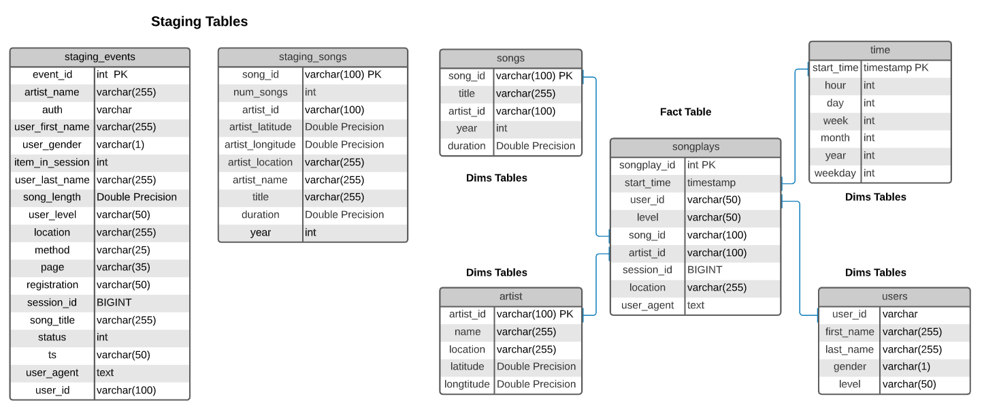

# Data Warehouse

## Introduction

A music streaming startup, Sparkify, has grown their user base and song database and want to move their processes and data onto the cloud. Their data resides in S3, in a directory of JSON logs on user activity on the app, as well as a directory with JSON metadata on the songs in their app.

As their data engineer, you are tasked with building an ETL pipeline that extracts their data from S3, stages them in Redshift, and transforms data into a set of dimensional tables for their analytics team to continue finding insights in what songs their users are listening to. You'll be able to test your database and ETL pipeline by running queries given to you by the analytics team from Sparkify and compare your results with their expected results.

## Project Summary

In this project, you'll apply what you've learned on data warehouses and AWS to build an ETL pipeline for a database hosted on Redshift. To complete the project, you will need to load data from S3 to staging tables on Redshift and execute SQL statements that create the analytics tables from these staging tables.

The main Ttask is to build an ETL Pipeline that extracts data from S3, staging it in Redshift, conduct data transformation into a set of Dimensional and Fact Tables to provide insights about this data.

## Project Dataset
The below datasets were used in this project:
1. s3://udacity-dend/log_data
2. s3://udacity-dend/log_json_path.json
3. s3://udacity-dend/song_data

## Database Design
There are two stagging tables build with the JSON files from the AWS S3 Bucket.

+ **staging_songs** - infrmation about songs and artists
+ **staging_events** - users activity

A star schema was selected for simplicity and speed, the schema's tables are:

#### Fact Table 
+ **songplays** - records in event data associated with song plays i.e. records with page `NextSong`

#### Dimension Tables
+ **users** - users in the app user_id, first_name, last_name, gender, level
+ **songs** - songs in music database song_id, title, artist_id, year, duration
+ **artists** - artists in music database artist_id, name, location, lattitude, longitude
+ **time** - timestamps of records in songplays broken down into specific units start_time, hour, day, week, month, year, weekday

### Database Schema
The database schema is shown as follows

### Project Steps
Below are steps you can follow to complete each component of this project.

### Create Table Schemas
1. Design schemas for your fact and dimension tables
2. Write a SQL CREATE statement for each of these tables in sql_queries.py
3. Complete the logic in create_tables.py to connect to the database and create these tables
4. Write SQL DROP statements to drop tables in the beginning of create_tables.py if the tables already exist. This way, you can run create_tables.py whenever you want to reset your database and test your ETL pipeline.
5. Launch a redshift cluster and create an IAM role that has read access to S3.
6. Add redshift database and IAM role info to dwh.cfg.
7. Test by running create_tables.py and checking the table schemas in your redshift database. You can use Query Editor in the AWS Redshift console for this.

### ETL Pipeline
1. Implement the logic in etl.py to load data from S3 to staging tables on Redshift.
2. Implement the logic in etl.py to load data from staging tables to analytics tables on Redshift.
3. Test by running etl.py after running create_tables.py and running the analytic queries on your Redshift database to compare your results with the expected results.
4. Delete your redshift cluster when finished.

### Document Process
Do the following steps in your README.md file.

1. Discuss the purpose of this database in context of the startup, Sparkify, and their analytical goals.
2. State and justify your database schema design and ETL pipeline.
3. [Optional] Provide example queries and results for song play analysis.

## Project structure
1. **create_tables.py** folder with the project data
2. **sql_queries.py** SQL statements required to perform the analysis
3. **etl.py** Python script with instructions to extract JSON data from S3 bucket and Redshift ingestion
4. **dwh.cfg** configuration file with info about Redshift, IAM and S3
5. **README.md** Project description and instructions

## Instructions
1. Import all the necessary libraries.
2. Write the configuration of AWS Cluster, store the important parameter in some other file

At the terminal:
3.  Create tables by running create_tables.py.
4.  Execute ETL process by running etl.py.

## Author 
Steven Melendez Lara [linkedin](https://www.linkedin.com/in/stevenmelendezl//), [Github](https://github.com/smelendez25/)

## References
The following References were used in this work, some lines of codes, wording and examples were used.

1. https://github.com/rhoneybul/udacity-dend-data-warehousing
2. https://github.com/saurabhsoni5893/DEND-Data-Warehouse-with-AWS
3. https://github.com/bondxue/Data-Warehouse-with-AWS
