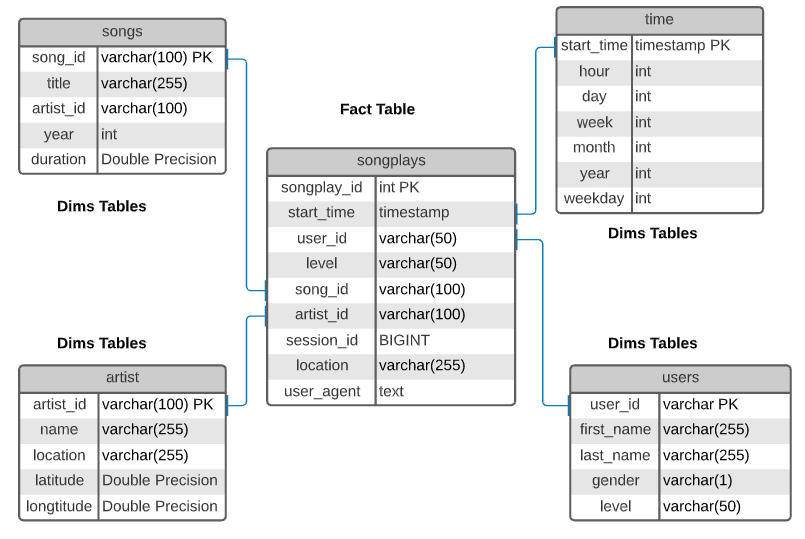

# Project 04 - Data Lake & Spark

## 1- Introduction

A music streaming startup, Sparkify, has grown their user base and song database even more and want to move their data warehouse to a data lake. Their data resides in S3, in a directory of JSON logs on user activity on the app, as well as a directory with JSON metadata on the songs in their app.

As their data engineer, you are tasked with building an ETL pipeline that extracts their data from S3, processes them using Spark, and loads the data back into S3 as a set of dimensional tables. This will allow their analytics team to continue finding insights in what songs their users are listening to.

You'll be able to test your database and ETL pipeline by running queries given to you by the analytics team from Sparkify and compare your results with their expected results.

## 2- Project Summary

In this project, you'll apply what you've learned on Spark and data lakes to build an ETL pipeline for a data lake hosted on S3. To complete the project, you will need to load data from S3, process the data into analytics tables using Spark, and load them back into S3. You'll deploy this Spark process on a cluster using AWS.

## 3- Project Dataset
The below datasets were used in this project:
1. Song data: s3://udacity-dend/song_data
2. Log data: s3://udacity-dend/log_data

## 4- Database Design
A star schema was selected for simplicity and speed, the schema's tables are:

### Fact Table 
+ **songplays** - records in event data associated with song plays i.e. records with page `NextSong`

### Dimension Tables
+ **users** - users in the app user_id, first_name, last_name, gender, level
+ **songs** - songs in music database song_id, title, artist_id, year, duration
+ **artists** - artists in music database artist_id, name, location, lattitude, longitude
+ **time** - timestamps of records in songplays broken down into specific units start_time, hour, day, week, month, year, weekday

### Database Schema
The database schema is shown as follows

## 5- Project Steps
Below are steps you can follow to complete each component of this project.

### ETL Pipeline
1. Implement the logic in etl.py to load data from S3 to EMR Cluster Tables
2. Implement the logic in etl.py to load data from EMR Cluster tables to S3 again.
3. Test by running etl.py after running the queries in Jupyter Notebooks to compare your results with the expected results.
4. Delete EMR cluster when finished.

### Document Process
Do the following steps in your README.md file.

1. Discuss the purpose of this database in context of the startup, Sparkify, and their analytical goals.
2. State and justify your database schema design and ETL pipeline.
3. [Optional] Provide example queries and results for song play analysis.

## 6- Project structure
1. **etl.py** Reads data from S3, processes that data using Spark, and writes them back to S3
2. **dl.cfg** configuration file with info about AWS credentials
3. **test.ipynb** ETL's test file
4. **README.md** Project description and instructions

## 7- Instructions
1. Import all the necessary libraries.
2. Write the configuration of AWS Cluster, store the important parameter in some other file

### At the terminal:
3.  Execute ETL process by running etl.py.

### At Jupyter Notebook:
4.  Run the test for verification purposes

## 8- Author 
Steven Melendez Lara [linkedin](https://www.linkedin.com/in/stevenmelendezl//), [Github](https://github.com/smelendez25/)

## 9- References
The following References were used in this work, some lines of codes, wording and examples were used in this project.

1. https://github.com/jukkakansanaho/udacity-dend-project-4
2. https://github.com/saurabhsoni5893/Udacity-Data-Engineering-Projects/tree/master/Data-Lakes-with-Spark
3. https://github.com/bondxue/Udacity-Data-Engineering/tree/master/Data-Lake-with-Spark
4. https://github.com/danieldiamond/udacity-dend/tree/master/data_lake_spark
