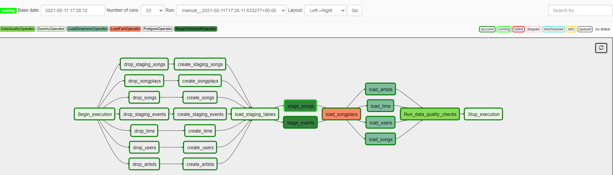

# Project 05 - Data Pipelines with Airflow

## 1- Introduction

A music streaming company, Sparkify, has decided that it is time to introduce more automation and monitoring to their data warehouse ETL pipelines and come to the conclusion that the best tool to achieve this is Apache Airflow.

They have decided to bring you into the project and expect you to create high grade data pipelines that are dynamic and built from reusable tasks, can be monitored, and allow easy backfills. They have also noted that the data quality plays a big part when analyses are executed on top the data warehouse and want to run tests against their datasets after the ETL steps have been executed to catch any discrepancies in the datasets.

The source data resides in S3 and needs to be processed in Sparkify's data warehouse in Amazon Redshift. The source datasets consist of JSON logs that tell about user activity in the application and JSON metadata about the songs the users listen to.

Custom operators will be created to perform tasks such as staging the data, filling the data warehouse, and running checks on the data as the final step.

## 2- Project Dataset
The below datasets were used in this project:
1. Log data: s3://udacity-dend/log_data
2. Song data: s3://udacity-dend/song_data

## 3 - Airflow Data  Pipeline
The main goal in this project is to automate ETL pipelines through Airflow, extracting data from S3 buckets, loading data into staging tables and transforming the data into a star schema stored in AWS Redshift. 

### DAGS
The DAG below is created with the file udac_example_dag.py, which generates the DAG with all necessary tasks to read the files listed in the S3 buckets, create the staging tables and transform into the defined schema which is stored in AWS Redshift.  

The DAGS are shown as follows

### Operators
Using the song and log datasets, a star schema was created and optimized for queries.

### Database Design
There are two stagging tables build with the JSON files from the AWS S3 Bucket.

+ **staging_songs** - infrmation about songs and artists
+ **staging_events** - users activity

A star schema was selected for simplicity and speed, the schema's tables are:

### Fact Table 
+ **songplays** - records in event data associated with song plays i.e. records with page `NextSong`

### Dimension Tables
+ **users** - users in the app user_id, first_name, last_name, gender, level
+ **songs** - songs in music database song_id, title, artist_id, year, duration
+ **artists** - artists in music database artist_id, name, location, lattitude, longitude
+ **time** - timestamps of records in songplays broken down into specific units start_time, hour, day, week, month, year, weekday

### Database Schema
The database schema is shown as follows

## 4- Project structure
1. **udac_example_dag.py** contains the tasks and dependencies of the DAGS.
2. **create_tables.sql** contains the SQL queries used to create all the required tables in AWS Redshift
3. **sql_queries.py** contains the SQL queries used in the ETL process
4. **stage_redshift.py** Operator to read files from S3 and load into AWS Redshift staging tables
5. **load_fact.py** Operator to load the fact table in AWS Redshift
6. **load_dimension.py** Operator to read from staging tables and load the dimension tables in Redshift
7. **data_quality.py** Operator for data quality checking
3. **README.md** Project description and instructions

## 5- Instructions
1. Import all the necessary libraries.
2. AWS Credentials
3. Connection with Postgres Database

## 6- Author 
Steven Melendez Lara [linkedin](https://www.linkedin.com/in/stevenmelendezl//), [Github](https://github.com/smelendez25/)

## 7- References
The following References were used in this work, some lines of codes, wording and examples were used in this project.

1. https://github.com/davidrubinger/udacity-dend-project-5
2. https://github.com/gfkw/dend-project-5
3. https://github.com/danieldiamond/udacity-dend/tree/master/data_pipelines_airflow
4. https://github.com/jukkakansanaho/udacity-dend-project-5
5. https://github.com/FedericoSerini/DEND-Project-5-Data-Pipelines
